# Performance

So I use some optimisation technics and here's the results.

## First render

### Before

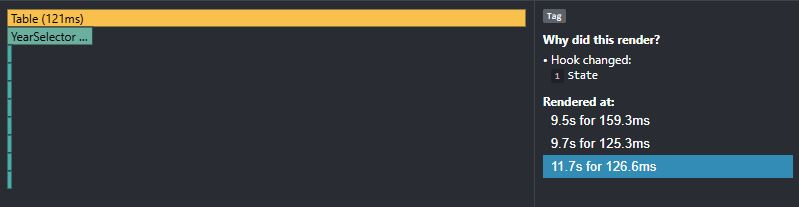
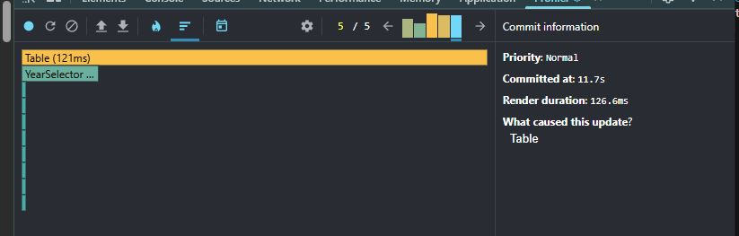

### After

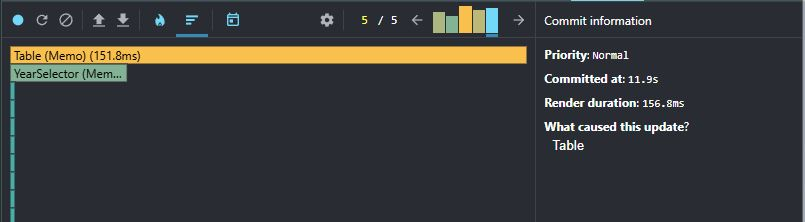

## Filter by Year

### Before

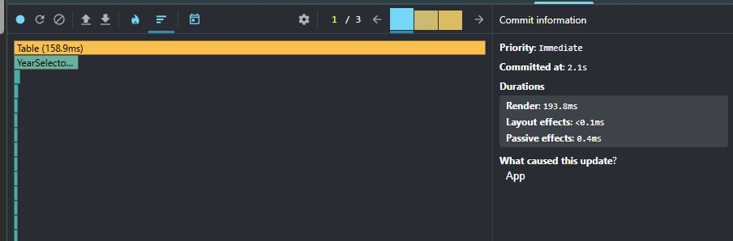

### After

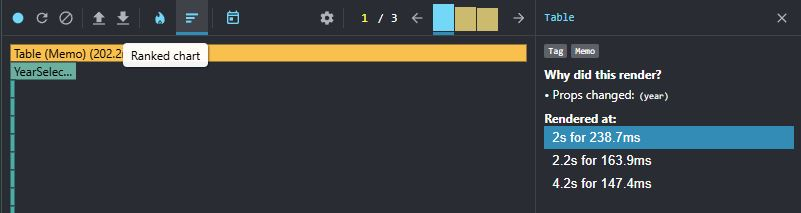

## Sort

### Before

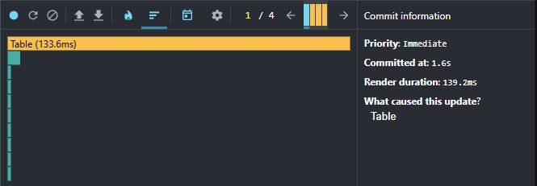

### After

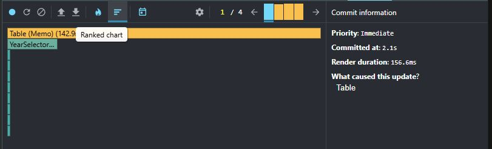

## Search by name

### Before

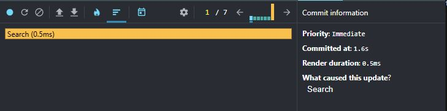

### After

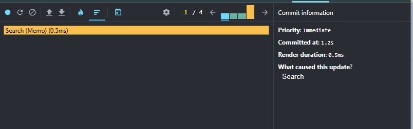

## Add cells to the table

### Before

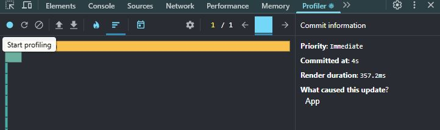

### After

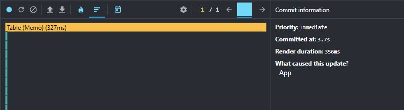

So it gets sligtly worse everywhere except Search component! We get 4 rerenders instead of 7! WOWZERS!!! 

